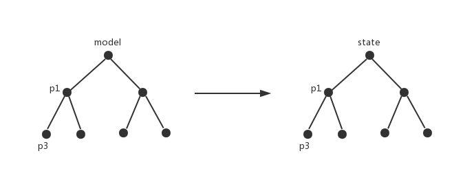
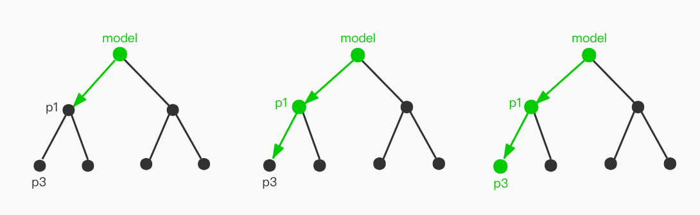
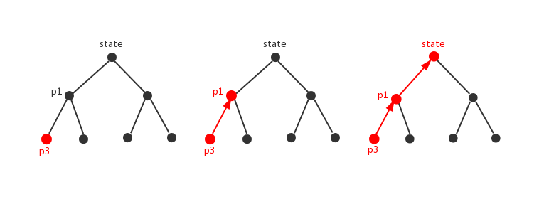

<a href="https://996.icu"></a>
[](https://travis-ci.com/ZhouYK/femo)
[](https://codecov.io/gh/ZhouYK/femo)
[](https://www.npmjs.com/package/femo)
[](https://www.npmjs.com/package/femo)


# femo

*针对对象操作的可预知、易测试的抽象封装*

### 发布 [](https://www.npmjs.com/package/femo)

```bash
npm i femo
or
yarn add femo
```

---
### 概览

#### 对象的模型



#### 获取对象的属性


```js
referToState(model.p1.p3)
```

#### 更新对象的属性



```js
model.p1.p3(data)
```

#### 发现

调用模式和原始的对象操作非常类似。看到这或许会想到mobx或者vuex。是的，和mobx、vuex在形上是很一致的，区别在于femo没有使用属性劫持或代理。

femo内部维护了一个抽象层。抽象层是树状结构，非对象类型(比如string、number、array、map、set等)的节点会被当做叶子节点，对象节点可以扩展子节点。
可以通过记录抽象层每个节点来获取数据、操作数据、监听每个数据变化。

那么如何创建抽象层呢？抽象层是由一个个节点组成的，那么先来看如何创建一个节点。

---

### 创建一个节点

```js
import { gluer } from 'femo';
const computer = gluer((data, state) => {
  return { ...state, ...data }
}, { cpu: 'intel', monitor: 'dell' });
```

节点的生成：
* 节点由gluer定义
* 节点包括两部分: 处理函数和初始值


#### 处理函数

**处理函数**的入参:

| data | state |
| :--- | :---  |
| 节点从外部接收的入参 | 节点当前的数据 |

**处理函数**的返回会作为节点新的值。


#### 初始值

**初始值**有两个作用：

* 节点初始的数据
* 节点的数据类型

初始值的类型会限制**处理函数**的入参**state**以及函数返回。

这里需要解释一下初始值作为节点数据类型的原因。最主要的原因是要对节点代表的数据在静态时需要有一个明确的类型限制和提示，便于代码的维护。

我们都知道javascript是一个动态类型的语言，一个变量的类型随时都可能变，这在一个上了规模的项目里面是很可怕的。近两年typescript在前端的兴起，代表了静态类型的趋势。
这里也借助了typescript的能力。

节点创建好了并不能直接当做数据来使用，需要通过节点来生成对象，通过对象才能被当做数据来使用。

> 这里隐含了一个信息，那就是节点可以被复用

---

### 创建对象

```js
import { gluer } from 'femo';
const computer = gluer((data, state) => {
  return { ...state, ...data }
}, { cpu: 'intel', monitor: 'dell' });

const electronicDevice = {
  computer,
  surface: computer,
  mbp: computer
};
export default electronicDevice;
```

这样就具备了生成对应数据的能力了。

需要明确一点：**创建的节点只有直接放在在对象里面才会生效，其他的不会生效**。

```js
// 不会生效
const electronicDevice = {
  list: [computer]
}

// 不会生效
const electronicDevice = {
  list: new Map([computer]),
};

// 生效
const electronicDevice = {
  list: computer,
}

```

---

### 应用对象

由节点生成的对象已经准备好了，现在需要让这些对象生效

```js
import femo from 'femo';
import electronicDevice from './electronicDevice';
const store = femo(electronicDevice);
```

将对象传递给**femo**函数，会得到一个工具对象store。所有对数据的相关操作都可以在store上找到。

```js
// 获取整个数据对象
console.log(store.getState());
// { computer: { cpu: 'intl', monitor: 'dell' }, surface: { cpu: 'intl', monitor: 'dell' }, mbp: { cpu: 'intl', monitor: 'dell' } }

// 监听某个节点
const unsubscribeSurface = store.subscribe([store.model.surface], (surface) => {
  // 如果surface节点对应的数据有变动，会执行该回调
});

// 取消
unsubscribeSurface();

// 获取某个节点的数据
console.log(store.referToState(store.model.surface)); // { cpu: 'intl', monitor: 'dell' }

// 判断节点是否存在
console.log(store.hasModel(store.model.surface)) // true
console.log(store.hasModel('index')) // false

// 更新节点数据
// 此时会调用定义节点时传入的处理函数处理数据
// 如果定义节点时没有传入任何处理函数，那么会提供一个默认的处理函数。该函数是 f(x) = x;
// surfaceState_1 是surface节点最新的state
const surfaceState_1 = store.model.surface({
    cpu: 'i5',
    monitor: 'lenovo',
});

// 自定义数据处理函数
// 此时数据处理时只会调用自定义数据处理函数，定义节点时传入的处理函数不会执行
const surfaceState_2 = store.model.surface({
	cpu: 'i7',
	monitor: 'asus'
}, (data, state) => {
  const temp = { ...data };
  temp.cpu = `surface-${temp.cpu}`;
  temp.monitor = `surface-${temp.monitor}`;
  return { ...state, ...temp };
});

console.log(store.referToState(store.model.surface)); // { cpu: 'surface-i7', monitor: 'surface-asus' }

// 支持异步的自定义处理函数
// surfaceState_3 是一个promise，surface节点的数据更新会延后

const surfaceState_3 = store.model.surface({
	id: '123'
}, async (data, state) => {
    // data { id: '123' }
    // state { cpu: 'surface-i7', monitor: 'surface-asus' }
    return {
        cpu: 'i9',
        monitor: 'Huawei'
    }
}).then((res) => {
    console.log(store.referToState(store.model.surface) === res); //true { cpu: 'i9', monitor: 'Huawei' }
});``
console.log(store.referToState(store.model.surface)); // { cpu: 'surface-i7', monitor: 'surface-asus' }
```

---

### 新增功能

#### 异步竞争

在实际开发过程中，会遇到一个比较隐晦问题：异步竞争。之所以说比较隐晦，是因为大部分情况下不会引起明显问题。开发人员大概率是知道有这个问题，
但出于各种原因会去搁置它，最主要的原因可能是代码大部分情况下是正常运行的，缺乏动力去改。另外要解决异步竞争，还是需要做一些努力。

代码有问题，一定会被发现。

什么是异步竞争？

常见的，先后发送了两个请求p1和p2，p1和p2都有各自的异步回调处理逻辑。一般情况下，先发出去的请求先回来，后发出去的请求后回来。
这种情况下异步回调的处理逻辑的先后顺序是符合预期的。但存在另外的情况，p1请求先发送后返回，p2请求后发送先返回。那么异步回调的处理顺序就不再是
p1的异步回调 => p2的异步回调，而是 p2的异步回调 => p1的异步回调。这种执行顺序显然是不符合预期的，会导致问题。

femo中为了解决异步竞争，提供了基于promise的方案。

```js
// 首先创建一个异步队列
const raceQueue = store.genRaceQueue();

// 然后将会出现竞争的异步promise放到同一个异步队列中

// ⚠️这里有个要求：放入异步队列的promise，在放入队列前不能定义then、catch、finally。
// 比如
// const p1 = store.model(params, async (data, state) => {
//         return await fetchRemote(data);
//       }).then(() => { //todo }).catch(() => { //todo }).finally(() => { //todo })
// raceQueue.push(p1);
// 这样是不会有作用的

const p1 = store.model.someData(params, async (data, state) => {
  return await fetchRemote(data);
});

// p2同理如p1
const p2 = store.model.someData(async (data, state) => { return await fetchRemote() });

raceQueue.push(p1);
raceQueue.push(p2);
// 放入竞争队列后，方可在p1、p2上进行操作
// p1.then().catch().finally();
// p2.then().catch().finally();

```
[具体的示例代码](https://github.com/ZhouYK/femo/tree/master/example/scripts/Profile.tsx)

### 类型支持

⚡️强烈建议使用typescript

